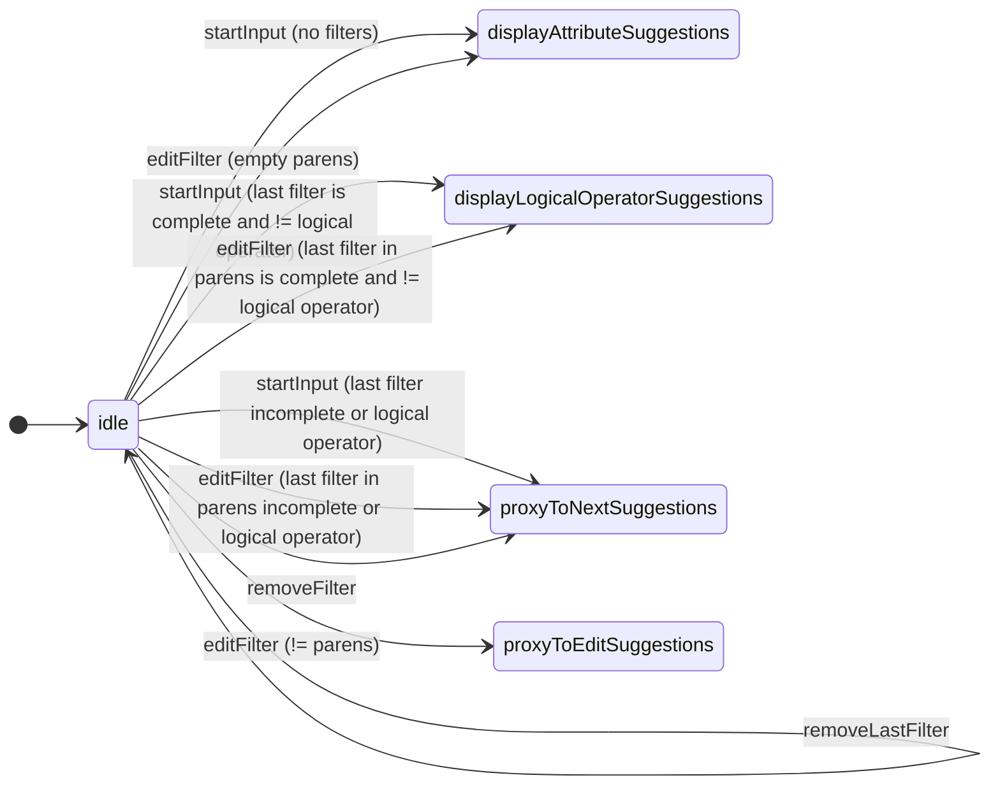
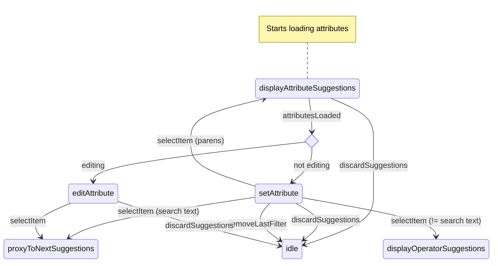
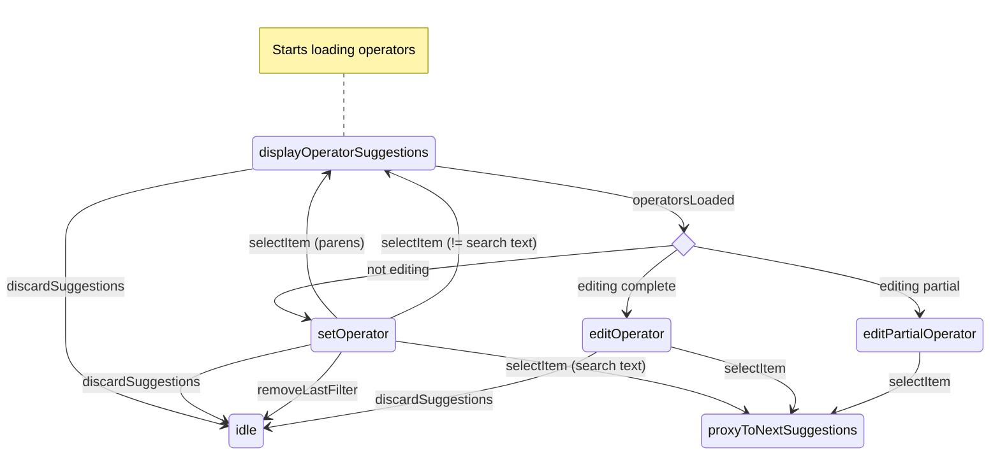

# 🧪 Lab project: a Filter Bar UI component

An experiment to build a filter bar UI component with:

- [React + hooks](https://reactjs.org/)
- [Semantic UI](https://react.semantic-ui.com/)
- [TVmaze API](https://www.tvmaze.com/api)
- A custom state machine implementation inspired by [XState](https://xstate.js.org/)

The code is not 100% production-ready (it's an experiment) but I believe that, as it is, it gives a pretty good idea on how to build this type of complex UI component.

## ⛩️ Architecture: core concepts

- State machine with domain context (the app state)
- The app state is observable
- The Filter Bar receives the app state as props
- The Filter Bar renders "dumb" UI components (Chiclet, ...)
- Suggestions are fetched from an HTTP client → API (+ cancellable requests)
- Clear contract on the data structure: suggestion item from the API → filter object → component prop
- Main states:
  - `idle` (waiting for user input),
  - `attribute suggestions` (loading and displaying)
  - `operator suggestions` (loading and displaying)
  - `value suggestions` (loading and displaying)
  - `logical operator suggestions` (loading and displaying)
- Proxy states (handle logic when editing/next suggestion):
  - `edit filter suggestions` (when a filter is edited)
  - `next suggestions` (check for partial filter every time a filter has been created, edited or deleted)

### State diagrams

Made with https://mermaid.js.org/

#### Idle state



#### displayAttributeSuggestions state



#### displayOperatorSuggestions state



#### displayValueSuggestions state

...

## 📗 Use cases

Launch and check the [end-to-end](cypress/e2e) tests: `npm run e2e:dev`

### Creation

Using the mouse or the keyboard:

1. Creation of a 3-part filter
2. Creation of a logical operator
3. Creation of search text filter
4. Creation of a 3-part filter with search text
5. Creation of 2-part filter

### Edition

Using the mouse or the keyboard:

- Edition of each part of the filters
- Changing a 3-part filter to a 2-part one and vice-versa
- Same with a partial attribute
- Same with a partial attribute and operator
- Changing a filter operator from "single" to "multi" type

### Deletion

Using the mouse or keyboard:

- Deletion of complete filters
- Deletion of a partial filter

### Loading

- Request cancellation
- Error: selection blocked, search text creation allowed

### Parens

- ...

## 🙈 Quirks/Issues

### Invalid state transitions

Choosing "Season" then the "IN" operator:

- sends a `selectItem` event with type = "multiple-value"
- transitions from `setOperator` → `displayValueSuggestions`
- sends a `startInput` event (!)
- 💥 which triggers an invalid transition `displayValueSuggestions` → `undefined`
- (...then a bit later) sends a `valueSuggestionsLoaded` event
- (...then a bit later) everything is all good

Why? Because the `startInput` event comes from:

- unmounting `<SuggestionDropdownSingle />`
- mounting `<SuggestionDropdowMulti />` with `open` = true
- which calls the `onOpen` prop
- which sends the `startInput` event

### Dropdown component warnings

- Choose "Season" then the "IN" operator
- Select 1 and 4
- Remove 1
- Close the dropdown

```text
Warning: Can't perform a React state update on an unmounted component. This is a no-op, but it indicates a memory leak in your application. To fix, cancel all subscriptions and asynchronous tasks in the componentWillUnmount method.
    at Dropdown (http://localhost:3000/static/js/bundle.js:52590:29)
```

After this:

- Change the "IN" operator for the "IS NULL" operator
- The filters are properly updated but the chiclet is not re-rendered

### Editing IN/NOT IN values with a partial filter present

The items of the multi-dropdown are selected on close.
When editing a multi dropdown and closing it by clicking on the document:

- the mouse down closes the multi dropdown,
- the partial suggestions dropdown is open and
- 💥 the mouse up closes it immediately (node_modules/semantic-ui-react/src/modules/Dropdown/Dropdown.js L160)

..resulting in poor UX :/

We've tried to introduce a 100ms delay in the `proxyToNextSuggestions` state to prevent the
dropdown that opens for the partial filter to be closed on mouse up but it produced wrong dropdown
placements when editing completed filter values and a partial filter is present.
